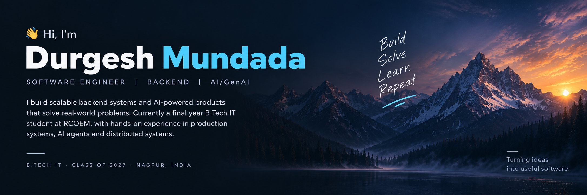
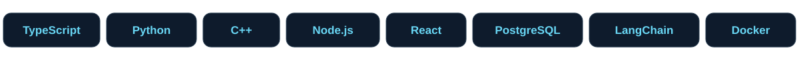

  

  <a href="https://portfolio-website-two-iota-22.vercel.app"><strong>Portfolio ↗</strong></a>
  &nbsp; · &nbsp;
  <a href="https://www.linkedin.com/in/durgesh-mundada-18b80b2a0/"><strong>LinkedIn ↗</strong></a>
  &nbsp; · &nbsp;
  <a href="mailto:mundadadurgesh@gmail.com"><strong>Email ↗</strong></a>

  <a href="#what-i-build">Focus</a> &nbsp; / &nbsp;
  <a href="#selected-work">Projects</a> &nbsp; / &nbsp;
  <a href="#tools-i-work-with">Tech stack</a> &nbsp; / &nbsp;
  <a href="#experience">Experience</a> &nbsp; / &nbsp;
  <a href="#education--credentials">Credentials</a>

### A little about me

I'm an Information Technology student at **RCOEM, Nagpur · Class of 2027**, and a former **Software Engineer Intern at ParkBy Technologies**. I enjoy turning messy workflows into useful software, connecting backend engineering with mobile development and applied AI.

**Open to internships and 2027 graduate roles** in software engineering, backend, full-stack, and applied AI. Based in Nagpur, India; open to relocation. [Let's connect →](mailto:mundadadurgesh@gmail.com)

### What I build

> **Reliable backends. Useful AI. Complete products.**

- **Backend systems** — authenticated APIs, multi-tenant databases, booking concurrency, and observable services. Put into practice in [KiranaTrack](https://github.com/Durgeshmundada/KiranaTrack) and my ParkBy internship.
- **AI grounded in evidence** — retrieval pipelines, tool-using agents, document OCR, and explanations that cite their sources. Explore [CodeSense](https://github.com/Durgeshmundada/codesense).
- **Products beyond the API** — mobile apps, real-time experiences, and workflows that connect frontend, backend, and deployment. See [CricZone](https://github.com/Durgeshmundada/CricZone).

**How I approach engineering:** validate inputs, isolate user data, test failure cases, and make behavior easy to trace. I care about understanding why a system works as much as getting it shipped.

---

### Selected work

<table>
  <tr>
    <td valign="top" width="50%">
      <h3><a href="https://github.com/Durgeshmundada/KiranaTrack">01 / KiranaTrack ↗</a></h3>
      
<strong>Supplier bills. Payments. Inventory.</strong>

      
A production mobile app for grocery shops, with multi-tenant data isolation, 25+ REST endpoints, and AI-assisted bill scanning.

      
Bill OCR achieved 85%+ accuracy and reduced manual data entry by approximately 70%.

      
TypeScript · Node.js · PostgreSQL · Expo / React Native

    </td>
    <td valign="top" width="50%">
      <h3><a href="https://github.com/Durgeshmundada/codesense">02 / CodeSense ↗</a></h3>
      
<strong>Understand why code exists.</strong>

      
An AI CLI that connects git history, GitHub issues and PRs, and architecture docs to produce source-cited explanations with confidence scores.

      
A five-node reasoning graph, four MCP retrieval tools, and 90+ tests.

      
Python · LangGraph · LangChain · MCP · ChromaDB

    </td>
  </tr>
  <tr>
    <td valign="top">
      <h3><a href="https://github.com/Durgeshmundada/CricZone">03 / CricZone ↗</a></h3>
      
<strong>From turf booking to live cricket.</strong>

      
A cricket community platform with booking, team management, tournaments, and real-time ball-by-ball scoring.

      
Includes authentication, live Socket.IO updates, an installable PWA, and an Android wrapper.

      
JavaScript · Node.js · Express · MongoDB · Socket.IO

    </td>
    <td valign="top">
      <h3><a href="https://github.com/Durgeshmundada/authenticity-platform">04 / VeriChain ↗</a></h3>
      
<strong>Privacy-first document verification.</strong>

      
Exploring browser-based AI, document fingerprinting, and tamper-evident verification records.

      
<strong>In development:</strong> the forensic analysis core is being rebuilt; this is an evolving project.

      
TypeScript · Next.js · WebAssembly · Polygon · PWA

    </td>
  </tr>
</table>

<strong>More projects: remote desktops, study tools, and networking</strong>

| Project | What I'm building | Stack / status |
| :--- | :--- | :--- |
| [Virtual Desktop Infrastructure](https://github.com/Durgeshmundada/virtual-desktop-infrastructure) | Stream a Windows desktop to Android with touch, mouse, and keyboard control over WebRTC. | Node.js, TypeScript, Kotlin, WebRTC · Prototype complete |
| [Study Assistant](https://github.com/Durgeshmundada/study-assistant) | DSA explanations, quizzes, flashcards, notes, and chat over uploaded documents. | Python, LangChain, Streamlit, RAG |
| PRAHARI | Developing an offline predictive network operations copilot, with local retrieval, network telemetry, and evidence-backed incident explanations. | Python, FastAPI, React, local LLMs · Active development |
| [DSA practice](https://github.com/Durgeshmundada/DSA) | My problem-solving practice in arrays, trees, graphs, dynamic programming, and more. | C++ |

### Tools I work with

  

| Area | Technologies |
| :--- | :--- |
| **Languages** | TypeScript, JavaScript, Python, C++, SQL, Kotlin, Java |
| **Backend** | Node.js, Express, FastAPI, REST APIs, JWT, Zod |
| **Data** | PostgreSQL / Supabase, MongoDB, ChromaDB, FAISS |
| **Applied AI** | LangChain, LangGraph, LangSmith, RAG, MCP, OCR, LLM tool-calling |
| **Delivery & testing** | Docker, GitHub Actions, Git, Render, Jest, Supertest, Hypothesis |

### On my desk right now

- **PRAHARI** — developing an offline network operations copilot with local AI and evidence-backed explanations.
- **VeriChain** — rebuilding the document forensic analysis core and exploring privacy-first browser AI.
- **Learning** — Django, system design, and deeper operating systems, computer networks, and database fundamentals.
- **Problem solving** — continuing my C++ practice in [data structures and algorithms](https://github.com/Durgeshmundada/DSA).

---

### Experience

**Software Engineer Intern · ParkBy Technologies Pvt. Ltd.** 
Nagpur · January–May 2026

- Built JWT authentication and **15+ REST endpoints** for user and resource management.
- Implemented atomic slot-reservation conflict handling; tested **100+ concurrent booking requests with zero double-bookings**.
- Built a Mapbox-powered dashboard for parking occupancy and booking management.
- Researched ANPR accuracy improvements using PaddleOCR, EasyOCR, and ensemble voting.

### Education & credentials

**B.Tech in Information Technology · RCOEM, Nagpur** 
2023–2027 · CGPA: **7.62 / 10**

- [**NVIDIA — Fundamentals of Deep Learning**](https://learn.nvidia.com/certificates?id=ZkNpIr0AR_yqSyOE92HXmg) · August 2026
- [**HackerRank — SQL (Advanced)**](https://www.hackerrank.com/certificates/2fbb808dc14c) · August 2026

<strong>Hackathons & leadership</strong>

- **Winner**, ChatGPT Challenge Hackathon.
- **Team leader and shortlisted**, Smart India Hackathon 2024 and 2025.
- **Participant**, Bharatiya Antariksh Hackathon 2026.
- **Publicity Head**, E-Cell, RCOEM TBI; **Executive Member**, Entrepreneurship Cell.
- **Graphics Lead**, CYBER CLUB, RCOEM.

---

  <strong>Have a useful problem to solve? Let's build something.</strong> 
  <a href="mailto:mundadadurgesh@gmail.com">mundadadurgesh@gmail.com</a>
  &nbsp; · &nbsp;
  <a href="https://portfolio-website-two-iota-22.vercel.app">Explore my portfolio ↗</a>

